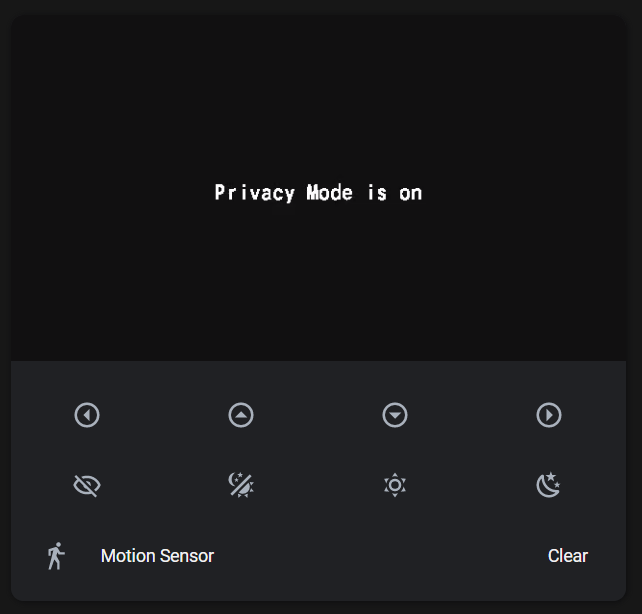

# HomeAssistant - Tapo: Cameras Control Examples

Below you can find some examples of usage of this custom component in lovelace cards.

- In all the examples, you need to replace camera entity with your entity and adjust the service calls according to your environment.
- See [documentation for picture-glance card](https://www.home-assistant.io/lovelace/picture-glance/)
- See [documentation for picture-entity card](https://www.home-assistant.io/lovelace/picture-entity/)

### Camera image in picture-entity


Very simple example which just shows a camera image and toggles light.

```yaml
type: picture-entity
entity: light.bedroom
camera_image: camera.bedroom_hd
```

### Camera image in picture-entity with stream


Very simple example which just shows a camera image and toggles light. It now uses the live stream of the camera.

```yaml
type: picture-entity
entity: light.bedroom
camera_image: camera.bedroom_hd
camera_view: live
```

### Camera control example


Example by [Roman Kaporin](https://github.com/JurajNyiri/HomeAssistant-Tapo-Control/issues/15#issuecomment-705228868).

Allows easy control of the camera.

```yaml
type: picture-glance
title: Bedroom
camera_image: camera.bedroom_hd
camera_view: live
entities:
  - entity: button.bedroom_move_left
    tap_action:
      action: toggle
  - entity: button.bedroom_move_up
    tap_action:
      action: toggle
  - entity: button.bedroom_move_down
    tap_action:
      action: toggle
  - entity: button.bedroom_move_right
    tap_action:
      action: toggle
  - entity: switch.bedroom_privacy
    tap_action:
      action: toggle
  - entity: button.bedroom_reboot
    tap_action:
      action: toggle
hold_action:
  action: more-info
```

### Camera Control Example with motion sensor

This example uses [stack-in-card](https://github.com/custom-cards/stack-in-card), [lovelace-card-mod](https://github.com/thomasloven/lovelace-card-mod) to make a seamless combo-card.



```yaml
type: "custom:stack-in-card"
cards:
  - type: picture-glance
    title: Bedroom
    camera_image: camera.tapo_camera_5489_sd
    camera_view: live
    entity: camera.tapo_camera_5489_hd
    entities:
      - entity: button.tapo_camera_5489_left
        tap_action:
          action: toggle
    hold_action:
      action: more-info
    style: |
      :host .box {
        display: none
      }
  - type: glance
    show_icon: true
    show_name: false
    show_state: false
    style: |
      ha-card.type-glance .entities,
      ha-card.type-glance .entity {
        padding: 0px;
        margin: 0px;
      }
      ha-card.type-glance {
        margin-top: 14px;
      }
    entities:
      - entity: button.tapo_camera_5489_left
        tap_action:
          action: toggle
      - entity: button.tapo_camera_5489_up
        tap_action:
          action: toggle
      - entity: button.tapo_camera_5489_down
        tap_action:
          action: toggle
      - entity: button.tapo_camera_5489_right
        tap_action:
          action: toggle
  - type: glance
    show_icon: true
    show_name: false
    show_state: false
    style: |
      ha-card.type-glance .entities,
      ha-card.type-glance .entity {
        padding: 0px;
        margin: 0px;
      }
      ha-card.type-glance {
        margin-bottom: 0px;
      }
    entities:
      - entity: switch.tapo_camera_5489_privacy
        tap_action:
          action: toggle
      - entity: camera.tapo_camera_5489_hd
        icon: "mdi:theme-light-dark"
        tap_action:
          action: call-service
          service: select.select_option
          service_data:
            entity_id: select.tapo_camera_5489_night_vision
            option: auto
      - entity: camera.tapo_camera_5489_hd
        icon: "mdi:weather-sunny"
        tap_action:
          action: call-service
          service: select.select_option
          service_data:
            entity_id: select.tapo_camera_5489_night_vision
            option: "off"
      - entity: camera.tapo_camera_5489_hd
        icon: "mdi:weather-night"
        tap_action:
          action: call-service
          service: select.select_option
          service_data:
            entity_id: select.tapo_camera_5489_night_vision
            option: "on"
  - type: entities
    entities:
      - entity: binary_sensor.tapo_camera_5489_motion
        name: Motion Sensor
    style: |
      ha-card.type-entities {
        margin-right: 14px;
      }
      ha-card.type-entities #states {
        padding-top: 10px;
      }
```

### Picture Glance with live view and scripts, tap and hold actions


```yaml
camera_image: camera.bedroom_hd
camera_view: live
entities:
  - entity: script.set_bedroom_camera_home
    icon: "mdi:palm-tree"
    tap_action:
      action: call-service
      service: script.set_bedroom_camera_away
  - entity: script.set_bedroom_camera_home
    icon: "mdi:home"
    tap_action:
      action: call-service
      service: script.set_bedroom_camera_home
  - entity: binary_sensor.bedroom_motion
  - entity: group.bedroom_upper_bed_left_lights
    icon: "mdi:coach-lamp"
  - entity: group.bedroom_upper_bed_right_lights
    icon: "mdi:coach-lamp"
  - entity: group.bedroom_ceiling_light
    icon: "mdi:ceiling-light"
hold_action:
  action: call-service
  service: python_script.set_camera
  service_data:
    entity_id: sensor.show_camera
    state: "70"
tap_action:
  action: more-info
title: Bedroom
type: picture-glance
```

- For entities, you can choose any entity in your home assistant
- For the `hold_action`, I am using my custom python script which changes state of any entity. You could replace this with any other action similarly to `tap_action` in entities.
- Binary sensor is automatically updated, put in your binary sensor for motion.

I have chosen to use scripts to execute camera actions as they affect both privacy mode and ptz and I could use them also in my automations.

```yaml
set_bedroom_camera_away:
  alias: "Privacy: OFF"
  sequence:
    - service: switch.turn_off
      data: {}
      target:
        entity_id: switch.bedroom_privacy
    - service: select.select_option
      data:
        option: Room
      target:
        entity_id: select.bedroom_move_to_preset
set_bedroom_camera_home:
  alias: "Privacy: ON"
  sequence:
    - service: select.select_option
      data:
        option: Privacy
      target:
        entity_id: select.bedroom_move_to_preset
    - delay: 00:00:10
    - service: switch.turn_on
      data: {}
      target:
        entity_id: switch.bedroom_privacy
```
