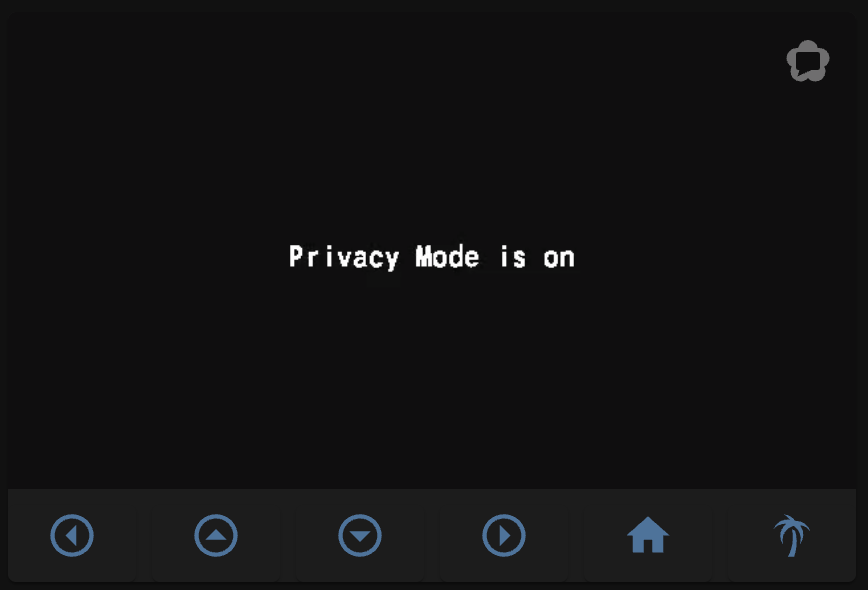

# HomeAssistant - Tapo: Cameras Control Examples

Below you can find some examples of usage of this custom component in lovelace cards.

- In all the examples, you need to replace camera entity with your entity and adjust the service calls according to your environment.
- See [documentation for picture-glance card](https://www.home-assistant.io/lovelace/picture-glance/)
- See [documentation for picture-entity card](https://www.home-assistant.io/lovelace/picture-entity/)

### Camera image in picture-entity


Very simple example which just shows a camera image and toggles light.

```yaml
type: picture-entity
entity: light.bedroom
camera_image: camera.bedroom_hd
```

### Camera image in picture-entity with stream


Very simple example which just shows a camera image and toggles light. It now uses the live stream of the camera.

```yaml
type: picture-entity
entity: light.bedroom
camera_image: camera.bedroom_hd
camera_view: live
```

### Picture Glance with live view and scripts, tap and hold actions


```yaml
camera_image: camera.bedroom_hd
camera_view: live
entities:
  - entity: script.set_bedroom_camera_home
    icon: "mdi:palm-tree"
    tap_action:
      action: call-service
      service: script.set_bedroom_camera_away
  - entity: script.set_bedroom_camera_home
    icon: "mdi:home"
    tap_action:
      action: call-service
      service: script.set_bedroom_camera_home
  - entity: binary_sensor.bedroom_motion
  - entity: group.bedroom_upper_bed_left_lights
    icon: "mdi:coach-lamp"
  - entity: group.bedroom_upper_bed_right_lights
    icon: "mdi:coach-lamp"
  - entity: group.bedroom_ceiling_light
    icon: "mdi:ceiling-light"
hold_action:
  action: call-service
  service: python_script.set_camera
  service_data:
    entity_id: sensor.show_camera
    state: "70"
tap_action:
  action: more-info
title: Bedroom
type: picture-glance
```

- For entities, you can choose any entity in your home assistant
- For the `hold_action`, I am using my custom python script which changes state of any entity. You could replace this with any other action similarly to `tap_action` in entities.
- Binary sensor is automatically updated, put in your binary sensor for motion.

I have chosen to use scripts to execute camera actions as they affect both privacy mode and ptz and I could use them also in my automations.

```yaml
set_bedroom_camera_away:
  alias: "Privacy: OFF"
  sequence:
    - service: switch.turn_off
      data: {}
      target:
        entity_id: switch.bedroom_privacy
    - service: select.select_option
      data:
        option: Room
      target:
        entity_id: select.bedroom_move_to_preset
set_bedroom_camera_home:
  alias: "Privacy: ON"
  sequence:
    - service: select.select_option
      data:
        option: Privacy
      target:
        entity_id: select.bedroom_move_to_preset
    - delay: 00:00:10
    - service: switch.turn_on
      data: {}
      target:
        entity_id: switch.bedroom_privacy
```

### Camera control example with webrtc and scripts



```yaml
type: custom:stack-in-card
cards:
  - type: custom:webrtc-camera
    entity: camera.bedroom_sd
  - type: horizontal-stack
    cards:
      - type: button
        icon: mdi:arrow-left-drop-circle-outline
        tap_action:
          action: call-service
          service: button.press
          service_data:
            entity_id: button.bedroom_move_left
        entity_id: camera.bedroom_sd
      - type: button
        icon: mdi:arrow-up-drop-circle-outline
        tap_action:
          action: call-service
          service: button.press
          service_data:
            entity_id: button.bedroom_move_up
        entity_id: camera.bedroom_sd
      - type: button
        icon: mdi:arrow-down-drop-circle-outline
        tap_action:
          action: call-service
          service: button.press
          service_data:
            entity_id: button.bedroom_move_down
        entity_id: camera.bedroom_sd
      - type: button
        icon: mdi:arrow-right-drop-circle-outline
        tap_action:
          action: call-service
          service: button.press
          service_data:
            entity_id: button.bedroom_move_right
        entity_id: camera.bedroom_sd
      - type: button
        icon: mdi:home
        tap_action:
          action: call-service
          service: script.set_bedroom_camera_home
        entity_id: camera.bedroom_sd
      - type: button
        icon: mdi:palm-tree
        tap_action:
          action: call-service
          service: script.set_bedroom_camera_away
        entity_id: camera.bedroom_sd
```
