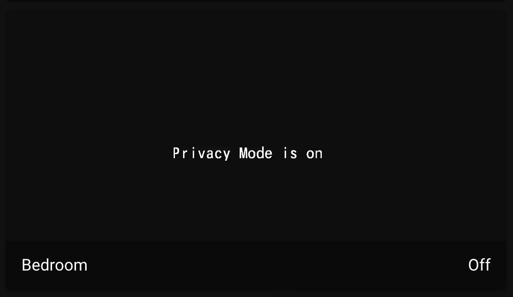
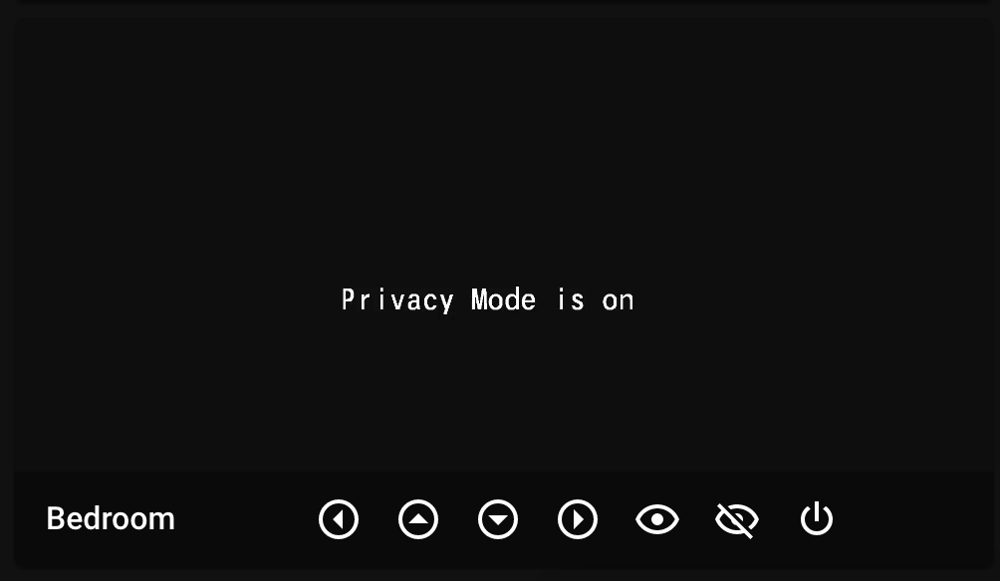
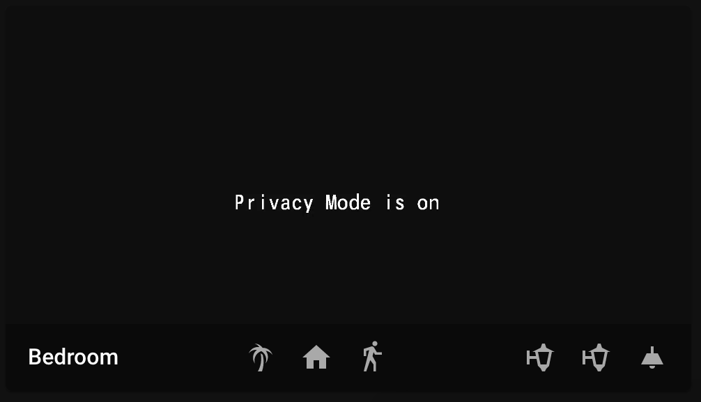

# HomeAssistant - Tapo: Cameras Control Examples

Below you can find some examples of usage of this custom component in lovelace cards.

- In all the examples, you need to replace camera entity with your entity and adjust the service calls according to your environment.
- See [documentation for picture-glance card](https://www.home-assistant.io/lovelace/picture-glance/)
- See [documentation for picture-entity card](https://www.home-assistant.io/lovelace/picture-entity/)

### Camera image in picture-entity



Very simple example which just shows a camera image and toggles light.

```
type: picture-entity
entity: light.bedroom
camera_image: camera.bedroom_hd
```

### Camera image in picture-entity with stream


Very simple example which just shows a camera image and toggles light. It now uses the live stream of the camera.

```
type: picture-entity
entity: light.bedroom
camera_image: camera.bedroom_hd
camera_view: live
```

### Camera control example



Example by [Roman Kaporin](https://github.com/JurajNyiri/HomeAssistant-Tapo-Control/issues/15#issuecomment-705228868). 

Allows easy control of the camera.

```
type: picture-glance
title: Bedroom
camera_image: camera.bedroom_hd
camera_view: live
entities:
  - entity: camera.bedroom_hd
    icon: 'mdi:arrow-left-drop-circle-outline'
    tap_action:
      action: call-service
      service: tapo_control.ptz
      service_data:
        entity_id: camera.bedroom_hd
        pan: LEFT
  - entity: camera.bedroom_hd
    icon: 'mdi:arrow-up-drop-circle-outline'
    tap_action:
      action: call-service
      service: tapo_control.ptz
      service_data:
        entity_id: camera.bedroom_hd
        tilt: UP
  - entity: camera.bedroom_hd
    icon: 'mdi:arrow-down-drop-circle-outline'
    tap_action:
      action: call-service
      service: tapo_control.ptz
      service_data:
        entity_id: camera.bedroom_hd
        tilt: DOWN
  - entity: camera.bedroom_hd
    icon: 'mdi:arrow-right-drop-circle-outline'
    tap_action:
      action: call-service
      service: tapo_control.ptz
      service_data:
        entity_id: camera.bedroom_hd
        pan: RIGHT
  - entity: camera.bedroom_hd
    icon: 'mdi:eye-outline'
    tap_action:
      action: call-service
      service: tapo_control.set_privacy_mode
      service_data:
        entity_id: camera.bedroom_hd
        privacy_mode: 'off'
  - entity: camera.bedroom_hd
    icon: 'mdi:eye-off-outline'
    tap_action:
      action: call-service
      service: tapo_control.set_privacy_mode
      service_data:
        entity_id: camera.bedroom_hd
        privacy_mode: 'on'
  - entity: camera.bedroom_hd
    icon: 'mdi:power'
    tap_action:
      action: call-service
      service: tapo_control.reboot
hold_action:
  action: more-info
```

### Picture Glance with live view and scripts, tap and hold actions



```
camera_image: camera.bedroom_hd
camera_view: live
entities:
  - entity: script.set_bedroom_camera_home
    icon: 'mdi:palm-tree'
    tap_action:
      action: call-service
      service: script.set_bedroom_camera_away
  - entity: script.set_bedroom_camera_home
    icon: 'mdi:home'
    tap_action:
      action: call-service
      service: script.set_bedroom_camera_home
  - entity: binary_sensor.bedroom_motion
  - entity: group.bedroom_upper_bed_left_lights
    icon: 'mdi:coach-lamp'
  - entity: group.bedroom_upper_bed_right_lights
    icon: 'mdi:coach-lamp'
  - entity: group.bedroom_ceiling_light
    icon: 'mdi:ceiling-light'
hold_action:
  action: call-service
  service: python_script.set_camera
  service_data:
    entity_id: sensor.show_camera
    state: '70'
tap_action:
  action: more-info
title: Bedroom
type: picture-glance
```

- For entities, you can choose any entity in your home assistant
- For the `hold_action`, I am using my custom python script which changes state of any entity. You could replace this with any other action similarly to `tap_action` in entities.
- Binary sensor is automatically updated, put in your binary sensor for motion.

I have chosen to use scripts to execute camera actions as they affect both privacy mode and ptz and I could use them also in my automations.

```
set_bedroom_camera_away:
  alias: Set Bedroom Camera Away
  sequence:
  - data:
      privacy_mode: 'off'
    service: tapo_control.set_privacy_mode
    entity_id: camera.bedroom_hd
  - service: tapo_control.ptz
    data:
      preset: Room
    entity_id: camera.bedroom_hd
  mode: single
set_bedroom_camera_home:
  alias: Set Bedroom Camera Home
  sequence:
  - data:
      preset: Privacy
    service: tapo_control.ptz
    entity_id: camera.bedroom_hd
  - delay: 00:00:10
  - service: tapo_control.set_privacy_mode
    data:
      privacy_mode: 'on'
    entity_id: camera.bedroom_hd
  mode: single
```
